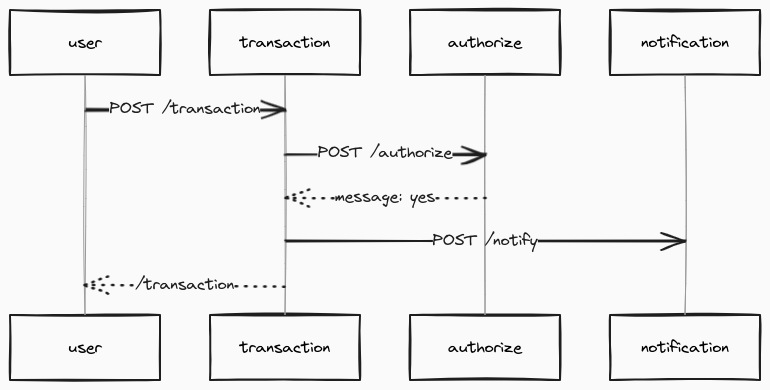

## Tecnologias
 
- [Spring Boot](https://spring.io/projects/spring-boot)
- [Spring MVC](https://docs.spring.io/spring-framework/reference/web/webmvc.html)
- [Spring Data JPA](https://spring.io/projects/spring-data-jpa)
- [Postgresql](https://www.postgresql.org/about/)

#### Acessar aplicação em `http://localhost:8080`


## Arquitetura

#### Layered Architecture
```
transferencia-app/
│
├── controllers/           # Controller
│   └── TransactionController.java
├── repositories/          # Repository
│   └── TransactionRepository.java
├── services/              # Service
│   └── TransactionService.java
├── domain/                # Entity / Domain Objects
│   └── Transaction.java
├── exception/             # Exceptions
│   └── TransactionException.java
│   └── GlobalExceptionHandler.java
├── utils/                 # Utils
│   └── WebClientUtils.java
```

#### Desenho da solução


#### Diagrama de sequencia



## API

- POST http://localhost:8080/api/transaction

```json
{
    "payerId": 1,
    "payeeId": 2,
    "value": 100.0
}
```
